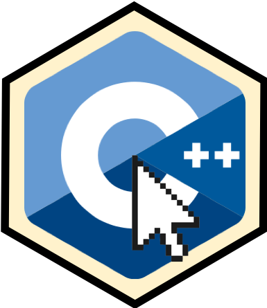

<!-- README.md is generated from README.Rmd. Please edit that file -->
rcppclick 
====================================================================

rcppclick makes it easier to write C++ scripts in RStudio.

Installation
------------

To install:

``` r
devtools::install_github("abichat/rcppclick")
```

Features
--------

rcppclick provides addins to:

-   comment lines inside R chunks,
-   remove R chunks.
