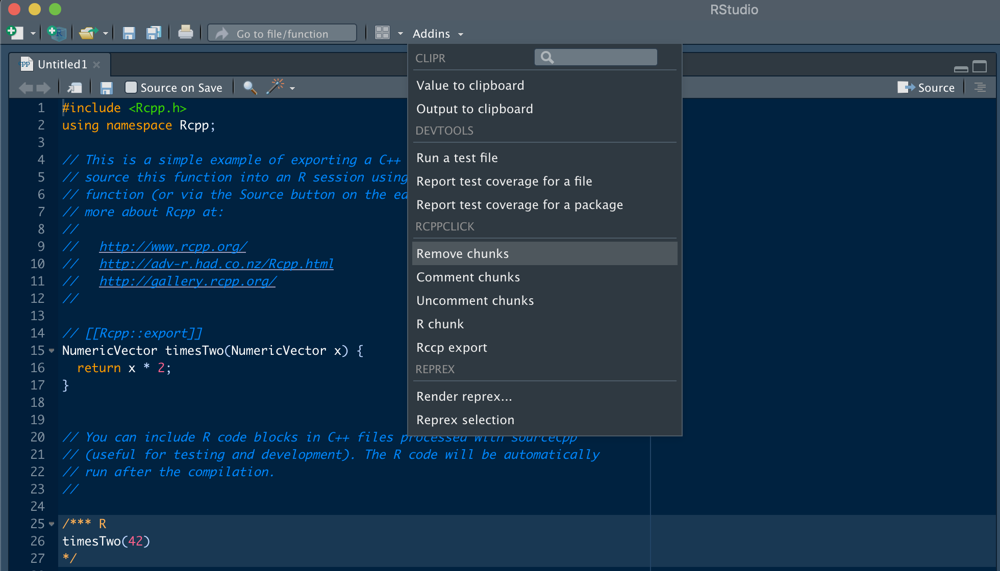

<!-- README.md is generated from README.Rmd. Please edit that file -->

# rcppclick 

rcppclick makes it easier to write C++ scripts in RStudio.

## Installation

To install:

``` r
devtools::install_github("abichat/rcppclick")
```

## Features

rcppclick provides addins to:

  - comment lines inside R chunks,
  - uncomment lines inside R chunks,
  - remove R chunks,
  - add a R chunk at the current position,
  - add a `// [[Rcpp::export]]` command at the current position.

## Usage

#### Addins

rcppclick features can be accessed through the Addins menu:



#### Shortcuts

Shortcuts for rcppclick features could be customized in Tools \> Modify
Keyboard Shortcuts.
